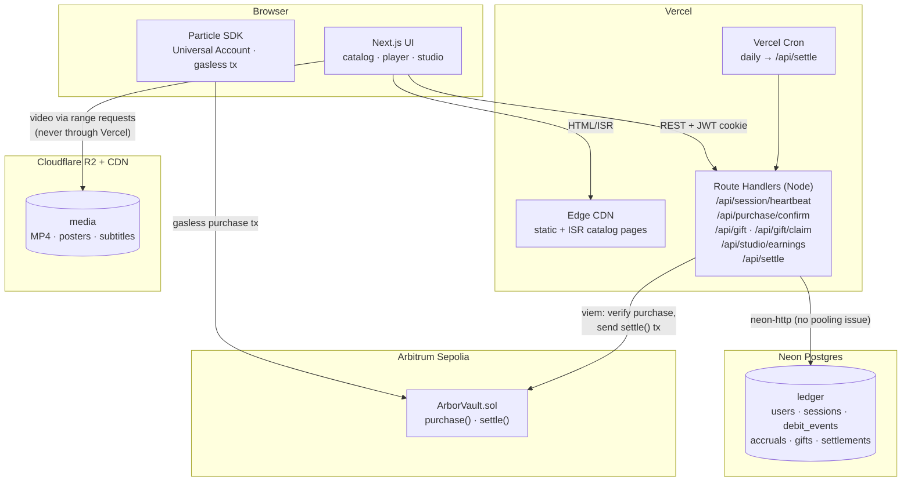
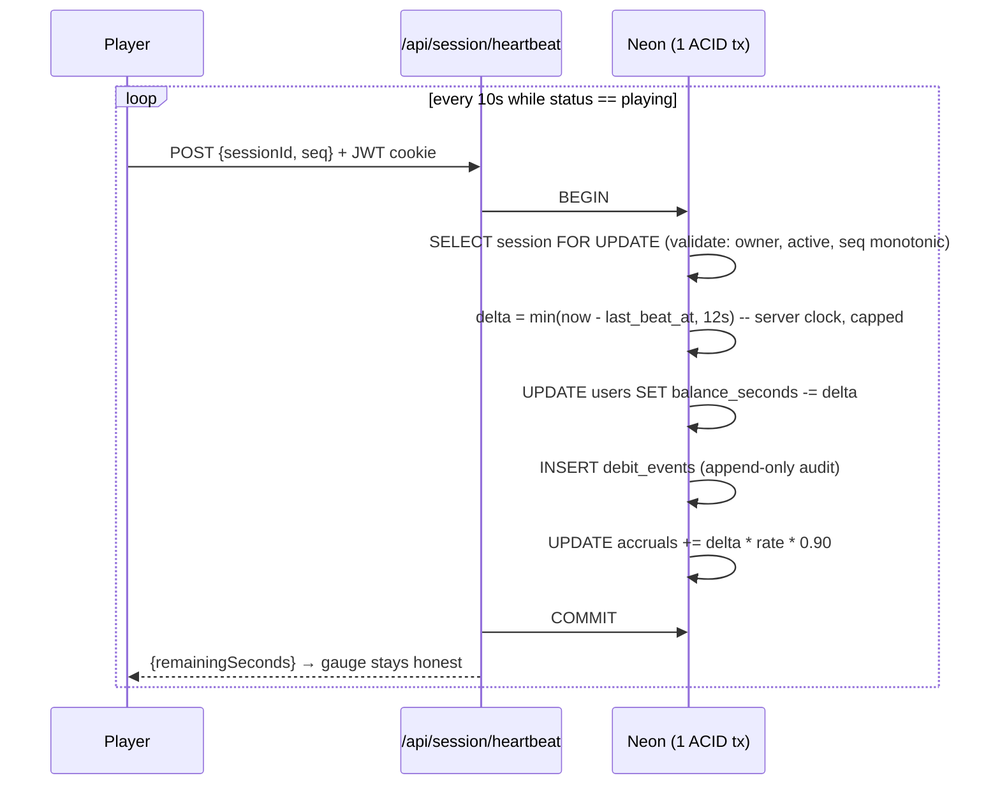
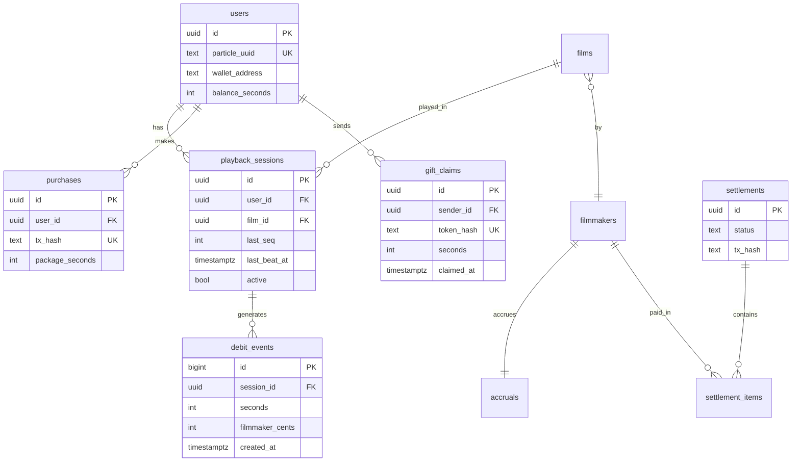

# Arbor — Infrastructure & Deployment Architecture

> Status: **accepted** · Scope: hackathon build + early-production path · Platform constraint: **Vercel (non-negotiable)**

This document derives the infrastructure from measured requirements, evaluates alternatives, and locks the stack. Simplicity wins ties.

---

## 1. Requirements Analysis (before any technology choice)

### 1.1 Workload model

| Dimension | Hackathon / demo | Early production (1k DAU) | Notes |
|---|---|---|---|
| Concurrent viewing sessions | ≤ 10 | ~100 peak | 1k DAU × ~1h watch/day |
| Heartbeat frequency | 1 per session / 10 s | same | The dominant write path |
| Aggregate heartbeat writes | ~1/s | ~10/s peak | Trivial for Postgres |
| Function invocations / month | thousands | ~10–12 M (heartbeats dominate) | Catalog browsing ≈ 0 invocations (static/ISR) |
| Purchases | dozens | ~100/day | Rare, transactional |
| Gifts | dozens | ~20/day | Rare, transactional |
| Settlements | manual (demo) | 1 batch/day | Cron-shaped, not queue-shaped |
| Catalog reads | high | high | Metadata changes rarely → cacheable |
| Media storage | < 3 GB (8 films @ 720p) | tens of GB | Egress is the cost driver, not storage |

### 1.2 Consistency & latency requirements

- **Balance ledger: strongly consistent.** A debit must atomically (a) decrement balance, (b) append a `debit_event`, (c) increment filmmaker accrual. Single-database ACID transaction — this rules out eventual-consistency stores for the ledger.
- **Heartbeat latency: tolerant.** Playback never blocks on a heartbeat; p95 < 500 ms is fine. The gauge tolerates 10 s staleness by design.
- **Catalog latency: fast.** Solved with static generation, not infrastructure.
- **Studio "live" earnings: soft real-time.** 5–10 s staleness acceptable → polling, not push.
- **Settlement: exactly-once.** Idempotent two-phase records around the on-chain call; retry-safe.

### 1.3 Conclusion from the numbers

At 10 writes/second peak, **this is a small OLTP workload wearing a streaming platform's clothes.** Video bytes never touch our backend (CDN-direct). No component below justifies queues, workers, Redis, or microservices at this scale. The architecture must instead optimize for: serverless-safe DB connections, zero-egress video delivery, and a ledger that cannot be cheated.

---

## 2. Final Recommended Stack

| Concern | Choice | One-line justification |
|---|---|---|
| Framework | **Next.js App Router** (Node runtime) | Vercel-native; UI + API in one deploy |
| Hosting | **Vercel** | Hard constraint |
| Database | **Neon Postgres** (Vercel Marketplace integration) | Serverless-native Postgres, HTTP driver kills pooling problem, scale-to-zero free tier |
| ORM | **Drizzle** (`drizzle-orm` + `neon-http` driver) | No engine binary → smaller cold starts; SQL-transparent; first-class Neon support |
| API style | **REST route handlers** + shared Zod schemas | 8 endpoints, 1 client, 3 devs, 7 days; visible in network tab during demo debugging |
| Heartbeat path | **Direct Postgres write, 1 transaction per heartbeat** | 10 writes/s doesn't need buffering; fewest moving parts |
| Live earnings (Studio) | **Polling (SWR, 5 s interval)** | WebSockets unsupported on Vercel functions; SSE holds functions open; polling is serverless-native |
| Settlement | **Vercel Cron (daily) → route handler**; manual trigger for demo | Cron-shaped job; no worker service justified |
| Media storage + CDN | **Cloudflare R2** (public bucket behind Cloudflare CDN) | Zero egress fees — decisive for video; S3-compatible |
| Video delivery | **Progressive MP4 with HTTP range requests, direct from R2** | Never proxied through Vercel functions |
| Chain access | **viem** (server: settlement signer; client: via Particle) | Light, typed, no legacy weight |
| Auth/session | Particle Universal Accounts (client) → server-verified → **httpOnly JWT cookie (jose)** | Backend must own identity for ledger writes |
| Redis / queues / workers | **None (hackathon)** — Upstash Redis rate-limiting only as a production add-on | Nothing in the workload is queue-shaped |

**Explicitly rejected for this build:** Supabase (unused surface — auth/realtime/storage all covered better elsewhere), Prisma (heavier serverless cold starts than Drizzle; no capability we need), PlanetScale (MySQL, no free tier), tRPC (setup tax > payoff at 8 endpoints), GraphQL (absurd overkill), Trigger.dev/Inngest/QStash (no queue-shaped work yet), AWS S3 (egress pricing wrong for video), Vercel Blob for video (egress billed; fine for small assets but one store is simpler), WebSockets/SSE (platform-hostile on Vercel), containers/microservices (three devs, seven days, one modest workload).

---

## 3. Infrastructure Diagram

## 4. Request Lifecycle — the three money paths

### 4.1 Heartbeat (dominant path)

Key property: **the server computes elapsed time from its own clock**, capped at interval + tolerance. The client claims nothing; it can only *fail to* heartbeat (which stops both playback token refresh and debiting — cheating gains nothing).

### 4.2 Purchase

1. Client: Particle gasless tx → `ArborVault.purchase(packageId)` (USDC pulled on-chain).
2. Client: POST `/api/purchase/confirm {txHash}`.
3. Server: viem reads receipt + `PackagePurchased` event → verifies payer = session user's account, package id, amount → credits `balance_seconds` in one tx with a `purchases` row keyed **unique on txHash** (idempotent — replaying the same hash cannot double-credit).

### 4.3 Settlement (exactly-once around an external call)

1. Cron (daily) or manual Studio button → `/api/settle`.
2. Tx A (DB): snapshot unsettled accruals → create `settlements` row `status=pending` + items; zero accruals. Commit.
3. Send `ArborVault.settle(addresses[], amounts[])` via server signer (viem).
4. Tx B (DB): record txHash, `status=confirmed`.
5. Crash between 3–4 → cron retry finds `pending` settlements, checks chain by settlement nonce before resending. Never double-pays.

`maxDuration = 60` on this route (Arbitrum confirms in seconds; generous margin). Fits Vercel limits (Hobby ≤ 60 s classic / higher with Fluid; Pro far above).

## 5. Database Architecture

**Relational (Postgres), event-sourced ledger, single database.**

- **Why relational:** ledger = the textbook ACID case. Multi-row invariants per heartbeat. NoSQL buys nothing and costs correctness.
- **Why Neon over Supabase/PlanetScale/RDS:** serverless HTTP driver (`@neondatabase/serverless`) → each route-handler invocation is a stateless HTTP call, **connection pooling ceases to be a failure mode** (the classic serverless+Postgres killer). Scale-to-zero free tier; branch-per-dev databases; official Vercel integration injects env vars. Supabase is fine software, but its differentiators (Auth, Realtime, Storage, RLS-from-client) are all things Arbor deliberately doesn't use — auth is Particle, media is R2, realtime is polling, and no client ever talks to the DB directly.

- **Indexing:** `purchases.tx_hash` UNIQUE (idempotency) · `gift_claims.token_hash` UNIQUE (single-use) · partial unique index `playback_sessions (user_id) WHERE active` (enforces one active session in the schema, not in app code) · `debit_events (session_id, created_at)` for Studio queries.
- **Integrity by construction:** `balance_seconds` is always recomputable as `Σ purchases + Σ gifts_in − Σ gifts_out − Σ debit_events`. An invariant check (dev script / future cron) makes ledger corruption detectable.
- **Migrations:** `drizzle-kit push` during hackathon velocity → generated SQL migrations committed to repo from day 6 onward.
- **Backups:** Neon point-in-time restore (built-in history retention; longer windows on paid tier). No self-managed backup machinery.
- **Scaling:** single Neon instance to ~1–2 k concurrent viewers (~100–200 writes/s). Beyond: §10.

## 6. Playback & Media Architecture

- **Heartbeat processing — evaluated options:**
  | Option | Verdict | Why |
  |---|---|---|
  | Direct Postgres write | ✅ **chosen** | 10/s peak; one moving part; transactional with accrual |
  | Buffer in Redis, flush batches | ❌ now, ✅ at ~50× scale | Adds a service + a consistency gap for zero present benefit |
  | Queue (QStash) per beat | ❌ | Per-message cost + latency on the hottest path; nothing async about a debit |
  | WebSocket/SSE stream | ❌ | Unsupported / function-hostile on Vercel serverless |
- **Video never touches Vercel.** Player streams MP4 directly from R2 via range requests. A route-handler proxy would burn function-duration and bandwidth quota and cap concurrency — architectural error, explicitly forbidden.
- **Gated playback (production item, optional for demo):** `/api/playback/token` issues a short-TTL presigned R2 URL only if `balance_seconds > 0`. Demo may use public URLs (content is CC-licensed) — flip to presigned without touching the player.
- **Why not Mux/Cloudflare Stream:** paid, and solves problems (transcoding ladders, DRM, uploads) Arbor doesn't have with 8 pre-encoded CC films. Adopt when real filmmaker uploads arrive.

## 7. Storage Comparison

| | Cloudflare R2 ✅ | Vercel Blob | Supabase Storage | AWS S3 |
|---|---|---|---|---|
| Egress (the video cost) | **$0** | billed past included quota | 5 GB free then billed | $0.09/GB — disqualifying |
| Storage free tier | 10 GB | 1 GB-ish included | 1 GB | none meaningful |
| CDN | Cloudflare, built-in | Vercel edge | via CDN | +CloudFront setup |
| Range requests / video | ✅ | ✅ | ✅ | ✅ |
| Ops for this team | one bucket + public URL | zero (but egress risk) | needs Supabase project just for this | IAM ceremony |

Posters/thumbnails/subtitles ride in the same R2 bucket (one store, one mental model); Next `<Image>` optimizes posters at the edge.

## 8. API & Security Architecture

**REST over route handlers.** Zod schemas shared client/server give 90 % of tRPC's safety with 0 % of its wiring; requests are inspectable in the network tab (matters in a live-demo failure). Server Actions rejected for the heartbeat loop (client-side serial execution queue; awkward for programmatic intervals) — permitted later for simple forms.

| Threat | Control |
|---|---|
| Identity forgery | Particle auth verified server-side once → httpOnly, SameSite=Lax, signed JWT cookie (jose). No bearer tokens in JS-readable storage |
| Heartbeat inflation/replay | Server-clock deltas capped at interval+2 s; monotonic `seq` per session; `FOR UPDATE` row lock; schema-level single-active-session |
| Double-credit purchase | `purchases.tx_hash` UNIQUE; server reads the receipt itself — never trusts client-claimed amounts |
| Gift theft/replay | 32-byte random token, **stored hashed** (SHA-256, like password-reset tokens); claim = atomic `UPDATE … WHERE claimed_at IS NULL`; debit sender at creation |
| Settlement double-pay | Two-phase settlement records; retry checks chain before resend; `settle()` is `onlyOwner`, SafeERC20, checks-effects-interactions |
| Key compromise | Settlement signer key: Vercel env var, server-only, **never** `NEXT_PUBLIC_*`, distinct from deployer, funded for testnet only. Production path: managed signer (KMS / Turnkey / OZ Defender relayer) |
| Rate abuse | Hackathon: per-user checks in ledger (balance can't go negative; one session). Production: `@upstash/ratelimit` on gift/claim/purchase-confirm + Vercel WAF |
| DB exposure | Connection string server-only; no client-side DB path exists (contrast Supabase RLS model — surface we never open) |

## 9. Vercel Constraint Checklist

| Constraint | Impact on Arbor | Resolution |
|---|---|---|
| No WebSockets on functions | No push channel | Polling (Studio) + heartbeat-response piggyback (gauge) |
| Function duration limits | Settlement waits for chain | `maxDuration=60` on `/api/settle`; Arbitrum confirms in ~seconds |
| Cold starts | Heartbeat p95 | Node runtime + Drizzle (no engine binary); steady heartbeat traffic keeps functions warm; latency non-blocking anyway |
| Connection pooling | Classic serverless-Postgres failure | Eliminated by neon-http (stateless HTTP per query) |
| Cron granularity (Hobby: daily) | Settlement cadence | Daily is the product design; demo uses manual trigger |
| Bandwidth/egress billing | Video | Video bypasses Vercel entirely (R2) |
| Edge runtime limits | none used | All handlers on Node — uniform, viem-safe. Edge adds a second runtime to reason about for zero measured win |
| Hobby = non-commercial, single-member | 3-person team | Hackathon demo OK on Hobby; **$20 Pro if team seats needed** — only real cost decision |

## 10. Alternatives Considered & Scaling Roadmap

**Alternative A — Supabase-everything** (DB+storage+auth): fewest vendors on paper, but Arbor uses none of its differentiators; video egress caps bite; rejected.
**Alternative B — Vercel-everything** (Marketplace Postgres + Blob): simplest signup story; egress cost risk on video; acceptable fallback if R2 setup stalls on day 1 (posters/films to Blob, migrate later — player only sees URLs).
**Alternative C — AWS (RDS+S3+Lambda@CloudFront)**: production-credible, hackathon-suicidal (IAM/VPC/pooler ceremony vs 7 days); rejected.

**Scaling roadmap (post-hackathon, in order of trigger):**
1. **~2 k concurrent viewers:** Upstash Redis heartbeat buffer → batched ledger flush every 10 s (QStash/Inngest worker); Neon autoscaling up.
2. **Real filmmaker uploads:** Mux or Cloudflare Stream (transcoding, signed playback, DRM); moderation pipeline.
3. **Settlement at 1000s of creators:** move to Inngest (step functions, retries, observability); managed signer (KMS/Turnkey).
4. **Global audience:** Neon read replicas for Studio/catalog queries; regional function placement.
5. **Mainnet:** contract audit; paymaster budget controls; fiat on-ramp.

Each step is additive — nothing in the hackathon architecture must be torn out. That is the test the design was chosen against.

## 11. Cost

| Phase | Bill |
|---|---|
| Hackathon | **$0** (Neon free, R2 free <10 GB, Particle free tier, Sepolia faucet, Vercel Hobby) — or **$20** one month of Pro if the team wants shared deploy access |
| Early production (1 k DAU) | ~**$45–65/mo**: Vercel Pro $20 + ~$5–10 usage · Neon Launch $19 · R2 ~$2 · Upstash ~$1–5 |
| Cost cliff to watch | Vercel function invocations scale with heartbeats (~11 M/mo at 1 k DAU ≈ ~$6); if invocation cost ever dominates, the Redis-buffer step (§10.1) cuts it ~6× as a side effect |
