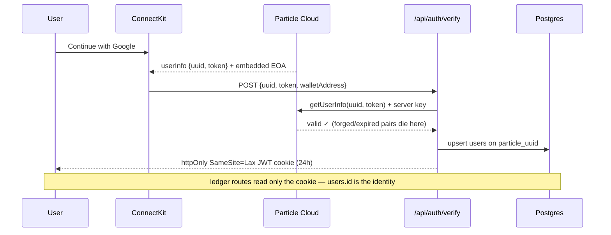
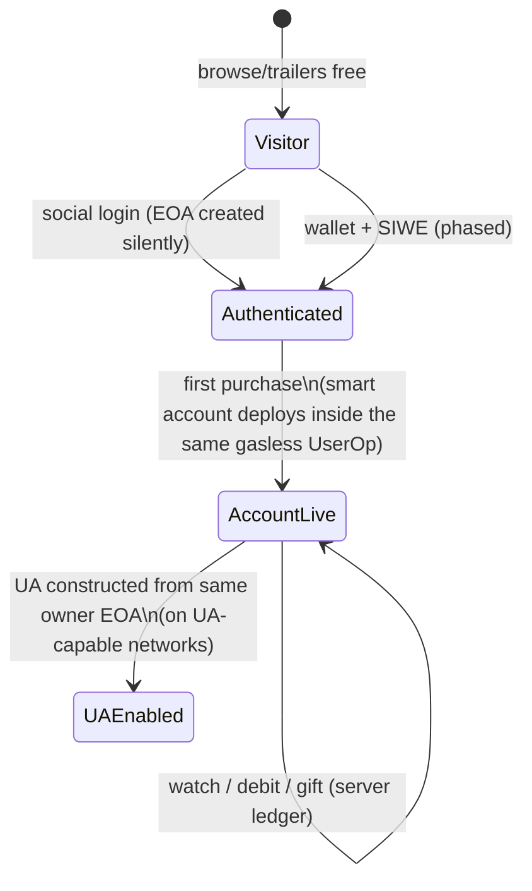

# Arbor — Authentication & Wallet Architecture

> Status: accepted · Scope: hackathon (Arbitrum Sepolia) → production (Arbitrum One)
> Related: [ARCHITECTURE.md](../ARCHITECTURE.md) §8 (security), [PLANNING.md](../PLANNING.md) §9 (UX rules)

## The invariant this document exists to protect

**Wallet abstraction must never leak into the playback experience.** Once
authenticated, every playback, package purchase, gift, creator settlement,
and viewing session behaves identically regardless of the authentication
method or wallet implementation.

## Architecture overview

```text
                User
                  │
        ┌─────────┴─────────┐
        │                   │
   Google / Apple      MetaMask / Coinbase
   / Email                  (SIWE — phased)
        │                   │
        └─────────┬─────────┘
                  │
          Particle ConnectKit          ← Layer 1: signer acquisition
                  │
      Embedded EOA / External EOA
                  │
   Smart Account / Universal Account   ← Layer 2: account model
   (network-capability dependent)
                  │
        Arbor Identity Layer           ← Layer 3: app identity
        (users.id only — backend never
         knows how the user signed in)
                  │
     Viewing packages · Watch sessions
     Gift links · Creator revenue
     Settlement
```

## Layer 1 — Signer acquisition (Particle ConnectKit 2.1.3)

| Path | Users | Status |
|---|---|---|
| **A — Social** (Google/Apple/Email → embedded MPC EOA, no seed phrase) | mainstream, ~95% | **P0 — built, verified** |
| **B — External wallet** (MetaMask/Coinbase) | crypto-native | **P1.5 — phased**: "Coming soon" graceful-disable now; SIWE when demo spine is green |

SDK decision (comparison ran against installed type definitions + Particle docs):
ConnectKit is the only Particle SDK covering both paths in one modal and
carrying the `aa()` gasless plugin. AuthKit = social-only subset (would have
sufficed for Path A alone). Universal Accounts SDK is an account layer, not
an auth SDK — it consumes an owner EOA from either.
Pin `@particle-network/connectkit@2.1.3` — the 3.0 alpha train has
unresolvable dependencies.

### Why SIWE for Path B (and why nothing else works)

Particle's server API surface: `getUserInfo` (social sessions only),
`getUserInfoByIdentity` (JWT provider only), `isProjectUser` (proves an
address belongs to *some* project user — membership, not possession).
None can verify that a request comes from the owner of an external wallet.
The only server-verifiable artifact an external EOA can produce is a
signature over a server-issued nonce — i.e. SIWE (~40 lines with viem
`verifyMessage`). Flow: `GET /api/auth/nonce` → wallet signs → `POST
/api/auth/siwe` → same session cookie as Path A. Nonces are single-use,
stored server-side, expiring.

## Layer 2 — Account model (lazy, counterfactual)

- **Testnet (hackathon):** Biconomy smart account via ConnectKit `aa()`
  plugin. Gasless through Particle's paymaster.
- **Mainnet (production):** Universal Account constructed from the same
  owner EOA — unified any-chain balance, Primary Asset routing.
- **UA availability is network-capability dependent** (currently: Ethereum,
  BNB, X Layer, Base, Arbitrum One, Solana). `lib/chain.ts` exposes a
  `universalAccountsSupported` flag per configured chain; if Particle adds a
  testnet tomorrow, one config line flips and nothing else changes.

**Account creation is lazy.** Login creates no on-chain anything. The smart
account address is derived counterfactually and the account materializes
inside the first purchase's gasless UserOp. Login stays instant; chain work
happens exactly when money first moves. The same rule will govern EIP-7702
upgrades for external EOAs: offered at first purchase ("enable one-tap
purchases"), never at connection.

## Layer 3 — Arbor identity

One verification, one cookie, everything downstream blind:



## Account lifecycle



## Identity roadmap — account linking

`users` is the primary entity; sign-in methods are attached identities.
Future shape (not built this week, schema-compatible by design):

```text
users (id, balance_seconds, …)
identities (user_id, type: google|apple|email|wallet|…, identifier, UNIQUE(type, identifier))
```

Today's `users.particle_uuid` / `wallet_address` columns become rows of
`identities` in a later migration. Enables Particle's strongest retention
story: start with Google, connect MetaMask months later, same viewing
balance, same history. Linking requires proving both identities in one
session — explicitly out of hackathon scope.

## Security summary

| Vector | Mitigation |
|---|---|
| Forged Particle session | server-side `getUserInfo` with server key ✅ |
| Session theft (XSS) | httpOnly + SameSite=Lax cookie ✅ |
| Wallet impersonation | SIWE signature + single-use nonce (with Path B) |
| Heartbeat forgery/replay | server-clock deltas, monotonic seq, row lock ✅ |
| Purchase replay | `UNIQUE(tx_hash)`, server reads receipt itself ✅ |
| Client-computed balances | none exist — server-only mutations ✅ |
| 7702 authorization phishing | deferred with 7702; pinned audited delegate only |

## Network strategy

All chain specifics (chain id, RPC, vault/USDC addresses, explorer URL,
capability flags) live in `lib/chain.ts`, driven by env. Nothing else
imports a chain object directly. Contracts and routes are identical across
networks; the account layer differs by declared capability, not by branch
logic scattered through the app. Mainnet additionally requires a funded
paymaster policy in the Particle dashboard (config + budget, not code).

## Phased roadmap

```text
NOW      social P0 · wallet connectors visible w/ "Coming soon" disable ·
         aa(BICONOMY) Sepolia · lazy accounts
DAY 5    SIWE if demo spine green → "MetaMask works" becomes literally true
LAUNCH   chain flip via env · funded paymaster · UA behind capability flag
LATER    7702 upgrade at first purchase · identities table + account linking ·
         passkey connector
```

## Open risk

Biconomy paymaster sponsorship on Arbitrum Sepolia is configured but
unverified live — proven by the first real login + gasless purchase. If it
fails: SimpleAccount via the same plugin, or server-relayed sponsorship.
The interface above survives either fallback.
